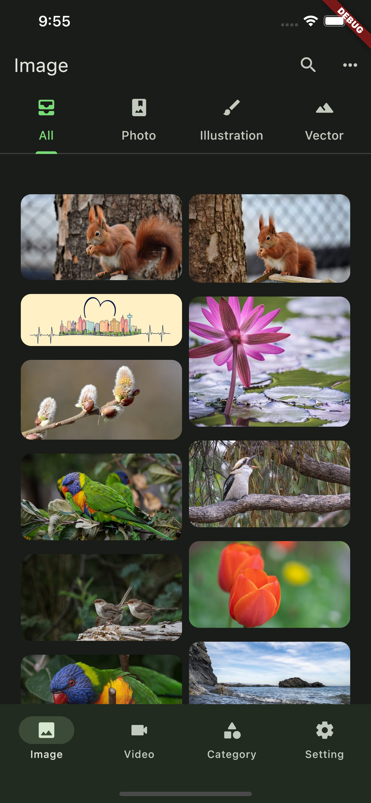
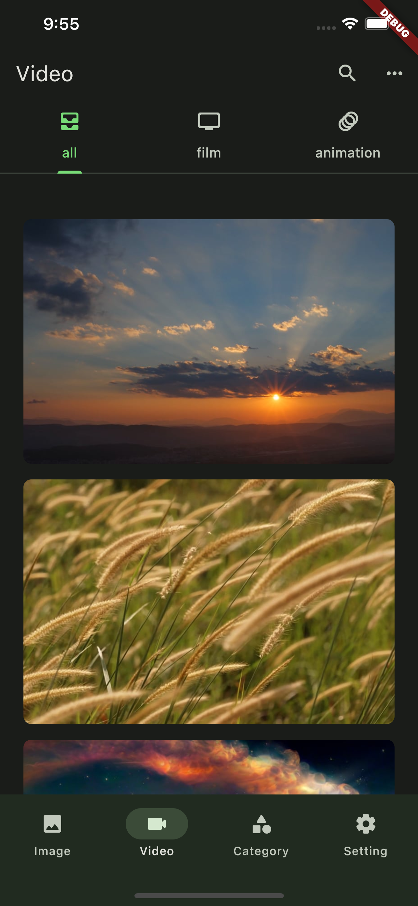
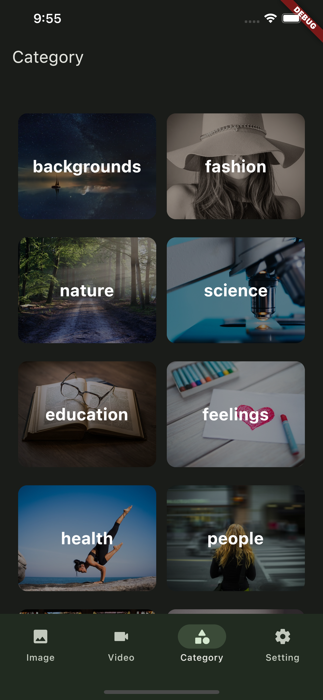

# flutter_pixabay

> Developed using [Pixabay Api](https://pixabay.com/zh/service/about/api/). App includes picture
> download and video download.There is also a picture and video search function

# How to use App?

1. download project
2. terminal run flutter pub get
3. find the constants file after opening the utils folder and modify the constant kApiKey to your
   apikey
4. run project

# App content

1. [x] Image Page
3. [x] Video Page
4. [x] Search Page
   1. [x] History
5. [x] Category Page
6. [x] Category Details Page 
7. [ ] Setting Page
    1. [x] Theme Page
        1. [x] Toggle Theme Mode
        2. [x] Select Theme Color
    2. [x] About Page
    3. [x] Privacy Page 
    4. [ ] Cache Page
        1. [ ] Toggle Cache (Default Open)
    5. [ ] Feedback Page
        1. [ ] Send Email
    6. [ ] Sponsor Page
        1. [ ] QRcode
8. [x] Image Details Page
    1. [x] Download Image
    2. [x] Origin Image
9. [x] Video Details Page
    1. [x] Download Video
    2. [x] Video Play

# App Screenshot

### ImageList

### VideoList

### SearchPage

### CategoryPage

# Dependencies

[provider: ^6.0.5](https://pub.dev/packages/provider)

[shared_preferences: ^2.0.18](https://pub.dev/packages/shared_preferences)

[dio: ^5.0.1](https://pub.dev/packages/dio)

[extended_nested_scroll_view: ^6.0.0](https://pub.dev/packages/extended_nested_scroll_view)

[flutter_staggered_grid_view: ^0.6.2](https://pub.dev/packages/flutter_staggered_grid_view)

[image_gallery_saver: ^1.7.1](https://pub.dev/packages/image_gallery_saver)

[video_player: ^2.6.0](https://pub.dev/packages/video_player)

[extended_image: ^7.0.2](https://pub.dev/packages/extended_image)

[path_provider: ^2.0.14](https://pub.dev/packages/path_provider)

[permission_handler: ^10.2.0](https://pub.dev/packages/permission_handler)

[hive: ^2.2.3](https://pub.dev/packages/hive)